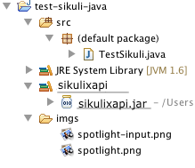
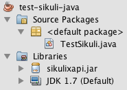
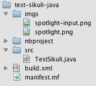

How to use SikuliX API in your JAVA programs
============================================

.. _howtojava:

The core of SikuliX is written in Java, which means you can use the SikuliX API as a standard JAVA library in your program. 

After having setup SikuliX on your system, as recommended at `Getting started <http://www.sikulix.com/quickstart.html>`_, you have to do the following:

1. Include sikulixapi.jar in the CLASSPATH of your Java project.
------------------------------------------------------------------- 

After adding sikulixapi.jar as a library reference into your project, the project hierarchy in Eclipse might look like this:

The same in Netbeans: 

Project view

Files view

2. Import the Sikuli classes you need
-------------------------------------

You can simply use 

.. code-block:: java

	import org.sikuli.script.*;

or import the classes you need:

.. code-block:: java

	import org.sikuli.script.Screen;

In most cases, you would need at least :py:class:`Screen` and/or :py:class:`Region`. 

Other candidates are :py:class:`Pattern`, :py:class:`Match`, :py:class:`Location`, :py:class:`App` and some more.

3. Write code!
--------------

Here is a hello world example on Mac. 
The program clicks on the spotlight icon on the screen, waits until spotlight's input window appears, activates it by clicking and then writes "hello world" into the field and hits ENTER.

.. code-block:: java

	import org.sikuli.script.*;
	
	public class TestSikuli {
	
		public static void main(String[] args) {
			Screen s = new Screen();
			try{
				s.click("imgs/spotlight.png");
				s.wait("imgs/spotlight-input.png");
				s.click();
				s.write("hello world#ENTER.");
			}
			catch(FindFailed e){
				e.printStackTrace();                    
			}	
		}

	}

A comment on projects using Maven
---------------------------------

It is planned, to publish sikulixapi.jar version 1.1.0+ on MavenCentral, so having a dependency in your project pom would be sufficient.

Until then you either have to use a path-based dependency or manually import sikulixapi.jar appropriately into your local Maven repo.  

See also
--------
Be aware, that some method signatures in the Java API differ from the scripting level.
 * `Javadoc of SikuliX (temporary location) <https://dl.dropboxusercontent.com/u/42895525/docs/index.html>`_.
 * :doc:`/sikuli-script-index`.

