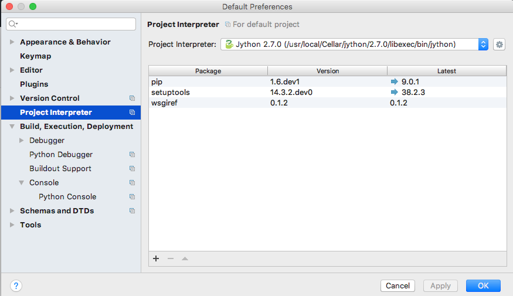
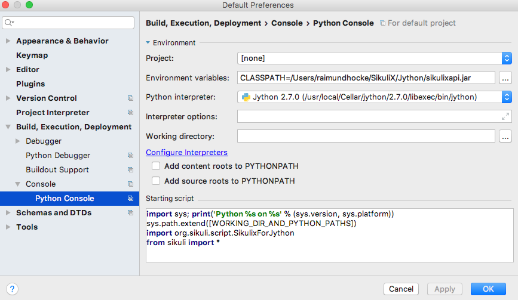

SikuliX - general aspects of scripting
======================================

What is a SikuliX script
------------------------

A SikuliX script is a workflow, that tries to perform actions against the GUI seen on a real screen, that otherwise must be performed manually. Usually it is a series of waiting for images to get visible on the screen and actions (mouse and/or keyboard) on visible GUI elements. The workflow statements usually are complemented with other elements of the used scripting language to implement more complex solutions with decisions, repetitions and states.

Example in Python language
::

    while True: # repeat the body forever
        wait("image1.png", 10) # wait max 10 seconds for image1 to get visible, otherwise die
        click("button1.png") # click the button given by image button1
        if exists("image2.png"): # wait max 3 seconds for image2 to get visible, return True or False
           doSomething() # in case True execute function doSomething (defined somewhere else)
        else:
           break # in case False get out of the loop, which ends the workflow
        # start all over with the line after the while
    # the end of the workflow  
    
In the IDE as standard the "foobar.png" are shown as thumbnails of the images (other options available).

To write, execute and debug SikuliX scripts you should know about the features of SikuliX and have at least a basic knowledge about the used scripting language.

A good starting point is to use the SikuliX IDE, to get used to the SikuliX features.

If things become more complex it might make sense, to switch to another IDE that supports your selected scripting language better.

Where and how can a SikuliX script be stored
--------------------------------------------

A SikuliX script consists of one file containing the statements of your scripted workflow and zero to many image files, that you have captured, to support your workflow.

This bunch of related files is meant when we talk about a SikuliX script.

How to run such a script is shown in the next chapter.

The standard storage for a SikuliX script is a folder/directory having the name that you have given to the script, when saving it from the IDE. It is mandatory, that the contained scriptfile has the same name as the folder, which is guaranteed, when working with the SikuliX IDE. To avoid any problems, you should never directly access the folder content outside the SikuliX IDE, except you really know, what you are doing.

On Mac the folder is seen as a package/bundle, which at the top level in Finder hides the content.

The folder and its content for the above example (in IDE we named it myscript)
::
    
    myscript.sikuli
        button1.png
        image1.png
        image2.png
        myscript.py
        
There are two other storage variants for SikuliX scripts: zip-file and jar-file, which are intended for distribution of your scripts. Both variants pack the SikuliX script content in one file, which makes distribution easier. Both variants can be run with the means of SikuliX, as long as the target system has a valid SikuliX installation/setup.

The jar-file variant has an option to be packed together with the scripting and SikuliX feature support (self contained), so it might be run on systems only having a valid Java installation.

- variant zip-file

  It can be created in the SikuliX IDE with the file menu entry "Export packed source" and gets the ending .skl instead of .sikuli. As such it cannot be reopened for editing nor used for import, it can only be run using SikuliX features on systems having a valid SikuliX setup. In fact it is simply a zip-file, which can be brought back to a .sikuli folder using a zip utility. So be aware, that this variant does not really hide your script content.
  
- variant jar-file (only available in 1.1.2+)

  It can be created in the SikuliX IDE (file menu entry "Export as jar"). It can be run using SikuliX features on systems having a valid SikuliX setup. The script source is contained in compiled form (Java byte code) and hence not visible, even if one accesses the jar content. So this variant gives some level of secrecy for your scripted workflow.
  
  There is a sub-variant, containing the scripting and SikuliX feature support additionally to the script content, which makes it runnable even on systems not having a valid SikuliX setup, but only a valid Java installation. Be aware, that such a jar has at least 60 MB though. `How to make and use it look here <https://answers.launchpad.net/sikuli/+faq/2947>`_.
        
How to run a SikuliX script 
---------------------------

In the SikuliX IDE a currently open script in the frontmost editor tab can be run by clicking the run button.

Saved scripts (.sikuli) and exported scripts (.skl and .jar) can be run from commandline (:ref:`see <RunningScriptsFromCommandLine>`) or from within other scripts (:ref:`see <RunningScripts>`).

Using JavaScript
================

One can use **JavaScript** for scripting with SikuliX features. 

The easiest approach:
 - switch a new editor tab in the IDE to type JavaScript (rigt-click on an empty Tab, select ``Set Type`` in the context menü and then select ``javascript`` from the drop down list). 
 - The bottom status line at the right side now will show ``(javascript)`` 
 - now you can write JavaScript code according to the `specifications of the Java bundled JavaScript interpreter (Nashorn since Java 1.7) <https://docs.oracle.com/javase/8/docs/technotes/guides/scripting/nashorn/index.html>`_.
 - before running the script the first time, you have to save it 

Example: ::

        Debug.user("hello from JavaScript");
        var img = "img.png";
        hover(img); // uses Screen(0) like in Python
        var scr = new Screen();
        print(scr);
        scr.hover(img); // uses the Region scr

The SikuliX features in general have to be used like in Java programming.
 - All classes from ``org.sikuli.script`` are known (pre-imported).
 - ``Debug`` and ``Settings`` are also known.

the following undotted methods work on Screen(0): ::

        wait, waitVanish, exists, click, doubleClick, rightClick, hover

and you have undotted: ::

        type, write, paste, run

**Be aware:** 
 - FindFailed is not thrown! internally returns null!
 - If you want to catch exceptions, you have to use the dotted methods.

.. _UsingPython:

Using Python
============

Setup a Jython environment
--------------------------

**This only applies to SikuliX 1.1.0+ with Jython 2.7.0+**

**Be aware:** Make sure you have a valid Java installation (version 1.7 or preferred: 1.8) 

**Note for Mac OSX**
If you ever encounter an error like ``ValueError: unknown locale: UTF-8``, then take care, that your environment at runtime of Jython contains these 2 entries:
 - LC_ALL=en_US.UTF-8
 - LANG=en_US.UTF-8
You might use ``export`` or any other appropriate method.

In cases you do not want to run scripts from inside the SikuliX IDE or from command line using the SikuliX command scripts or jar-files, you might setup your own Jython environment and run scripts.

Apply the following steps, to get a Jython environment, that is SikuliX aware:

 - download the installer package from `Jython Downloads <http://www.jython.org/downloads.html>`_
 - install (usually by double-clicking the package) using the standard setup into an empty folder 
 - test by running ``<jython-folder>/bin/jython`` from a commandline, which should open an interactive Jython session, that allows, to run Python statements line by line
 - make sure, that pip and easy_install are available:
  - ``<jython-folder>/bin/pip`` exists
  - ``<jython-folder>/bin/easy_install`` exists
  - if this is not the case run ``<jython-folder>/bin/jython -m ensurepip`` on a commandline and check again
  - if you do not get pip ready, don't bother: Jython is useable without it. The caveat: any additional packages have to be installed/setup manually.
  
If you succeeded with pip:

 - run ``<jython-folder>/bin/pip install jip`` to install the package ``jip``, which allows to add Java libraries easily to your Jython environment 
 - add any needed Python package (must not depend on C-based stuff) using ``pip``, ``easy-install`` or manual methods into ``<jython-folder>/Lib/site-packages`` and/or use ``jip`` for adding Java libraries preferably from Maven Central 
 
Access Python packages from SikuliX scripts run by SikuliX (GUI or commandline)
-------------------------------------------------------------------------------

The following approaches apply to situations, where you want to use Python modules installed somewhere on your system, without the need to manipulate ``sys.path``, meaning, that when using ``ìmport moduleXYZ`` this package is found automatically.

SikuliX uses a central repository (``SikulixRepo`` in the following) for internal stuff (native libraries, downloaded artifacts, resources needed at runtime and simailar things). This is a folder in the user's private space (home folder) :ref:`look here <SikulixAppData>`:
 - Windows: ``%APPDATA%\Sikulix``
 - Mac: ``~/Library/Application Support/Sikulix``
 - Linux: ``~/.Sikulix``

**Basic preparation**
    To ``SikulixRepo`` add a folder ``Lib`` (if not already there) and inside add a folder ``site-packages``
    
**Approach 1**
    Since an existing folder ``SikulixRepo/Lib/site-packages`` will be recognized and added automatically as the ``1st entry to sys.path``, modules/packages contained in here will be found when imported without any further preperations. This approach can be used, to "overwrite" modules/packages, that otherwise would be found elsewhere on ``sys.path`` (e.g. for testing)
    
**Approach 2**
    In the folder ``SikulixRepo/Lib/site-packages`` have a file ``sites.txt``, that contains absolute paths one per line, that point to other places, where modules packages can be found. These paths will be added automatically at startup to the ``end of sys.path`` in the given sequence. With this approach, you might for example add the ``Lib/site-packages`` folder of your own Jython installation.
    

.. _LoadableJars:

Prepare and use your own jar files in the Jython environment
------------------------------------------------------------

You might prepare jar files containing Python scripts/modules/packages, Java classes and other stuff like images, that are intended to be used in the scripting context.

**possible use cases**
 - you want to pack scripted stuff together with other resources into a container ready to be used by yourself or others via import (which is not supported by the .skl packaging method).
 - you want to secure your script code against modifications by others, that use your distributed jar.
 
Later (possibly only with version 2) there will be a feature available, to run such script containers directly from commandline (``java -jar mystuff.jar parameters``) or by double clicking.

**typical jar file structure**::

    -- jar rootlevel
    module1.py    # Python module
    module2.py
    - folder1     # Python package
      __init__.py
      stuff1.py
      stuff2.py
    - images      # image folder
      img1.png
      img2.png
    - org         # Java package
      - mystuff
        class1.class
        class1.class

**how to pack such a jar**

You might use the Java ``jar utility`` (contained in the JDK).

Or use the **SikuliX provided** feature ``Sikulix.buildJarFromFolder(jarpath, folder)``, where jarpath is the absolute path to the jar (the parent folder must exist, the jar is overwritten), that should be created and folder is the absolute path to a folder, containing the stuff to be packed. The content of the folder is copied to the root of the created jar.

Just run ``Sikulix.buildJarFromFolder(jarpath, folder)`` in an empty tab in the IDE or in a script, that might do some pre- and/or postprocessing.

If the folder contains an ``__init__.py`` on the first level, the given folder is taken as a Python package and as such copied to the root level of the jar, to preserve the package context::

    -- packagefolder
      __init__.py
      stuff.py
      
    becomes a jar
    -- jar rootlevel
    - packagefolder
      __init__.py
      stuff.py
 
**how to secure your script code using the jar packaging**
 - Step 1: prepare a folder as in the previous chapter
 - Step 2: compile the folder into a new folder (see below)
 - Step 3: pack the new folder into a jar for distribution
 
Run in an empty IDE tab or as part of a script:

``Sikulix.compileJythonFolder(sourcefolder, targetfolder)`` 

copies the complete content from sourcefolder to targetfolder (the parent folder must exist, the folder is emptied if exists) and then traverses the targetfolder replacing each ``foobar.py`` with it's compiled version ``foobar$py.class``, that contains JVM-byte-code, so your script code cannot be edited anymore in this targetfolder, but still be used with ``import foobar``.

**Be aware:** Be sure, your code compiles without errors, because the compile feature either succeeds or fails (compile errors), but you will not get any information about the cause or even the place of the compile problem.

Scripting with IntelliJ PyCharm and IDEA with Python plugin
-----------------------------------------------------------

.. versionadded:: X1.1.1

Among the free IDE's, that allow to work with Python projects, I made the best experiences over the years with JetBrains's PyCharm (using the free Community Edition) or the Python plugin in JetBrain's IntelliJ IDEA. For working with the SikuliX features, you have to use it with the Java based Jython as interpreter.

PyCharm has a weakness, in that code completion while editing does not look into jar-files nor Java classes, while in the built-in Python console after having imported a Java class, code completion about the class attributes/methods works, so having a console open while editing might help as a workaround for inspecting Java classes.

IntelliJ IDEA with Python plugin supports complete code completion (while editing and in console) including Java classes, but is a bit more complex to setup and use with just Python.

If you are more used to Eclipse, the Eclipse PyDev might be your choice for Python development. The steps to get it running for use with SikuliX are similar to the following steps for PyCharm. If someone wants to document the details for Eclipse PyDev, he/she is always welcome - I will not do it on my own.

This information is related to SikuliX version 1.1.1+ (recommended for use with mature IDE's).

**Step 1: get Jython up and running**

Just follow the steps mentioned in the chapter ``Setup a Jython environment`` above.

**Step 2: get PyCharm up and running**

Download and install the `PyCharm Community Edition <https://www.jetbrains.com/pycharm/>`_.

**Step 3: tell PyCharm to use Jython as interpreter**

Start PyCharm and make sure to have closed all projects and be in the start-up window titled ``Welcome to PyCharm``.

At bottom right in the menu ``Configure`` select ``Preferences``. You should get a dialog window titled ``Default Preferences``.

At the left side select ``Project Interpreter`` and choose your installed Jython by pointing to the contained ``.../bin/jython`` script/command-file.

Click ``Apply`` and watch how the Jython setup is analyzed and implemented in PyCharm. If it worked click ``Ok``.



**Step 4: setup the environment for a Python console**

As with the step before get the ``Default Preferences`` dialog open.

At the left side select ``Build, Execution, Deployment``... ``Console``... ``Python Console``.

To the ``Environment variables`` add antry ``CLASSPATH``, that points to a valid ``sikulixapi.jar`` (created using setup).

In the ``Starting script`` you might add the 2 lines
```
import org.sikuli.script.SikulixForJython
from sikuli import *
```
so each time you start a console, the prompt is already prepared to know about SikuliX features.



Using Ruby
==========

Using SikuliX in Java programming
=================================

To be written - but until then `read here <http://sikulix-2014.readthedocs.io/en/latest/faq/030-java-dev.html>`_

Using SikuliX in non-Java programming scenarios
===============================================

To be written

Using RobotFramework
====================

.. _UsingRobot

.. versionadded:: X1.1.1

You can run ready Robot scripts out of the box in the Sikulix context (IDE or from commandline). The needed Python module robot ( from `robotframework 3.0 <https://pypi.python.org/pypi/robotframework>`_ ) is bundled with the ``sikulixapi.jar``. At runtime and already with setup, the module is exported to the folder ``<SikulixAppData>/Lib``, which is on ``sys.path`` automatically. So there is no need to have anything else available than a suitable setup of SikuliX.

The easiest way is to use the SikuliX IDE with this principal setup
::

        runScript("""
        robot
        *** Variables ***
        ${USERNAME}               demo
        ${PASSWORD}               mode
        ${TESTSITE}               http://test.sikuli.de
        *** Settings ***
        Library           ./inline/LoginLibrary
        Test Setup        start firefox and goto testsite    ${TESTSITE}
        Test Teardown     stop firefox
        *** Test Cases ***
        User can log in with correct user and password
            Attempt to Login with Credentials    ${USERNAME}    ${PASSWORD}
            Status Should Be    Accepted
        User cannot log in with invalid user or bad password
            Attempt to Login with Credentials    betty    wrong
            Status Should Be    Denied
        """)
        
        class LoginLibrary(object):
          def start_firefox_and_goto_testsite(self, page):
            popup("start_firefox_and_goto_testsite")
          def stop_firefox(self):
            popup("stop_firefox")
          def attempt_to_login_with_credentials(self, username, password):
            popup("attempt_to_login_with_credentials")
          def status_should_be(self, expected):
            popup("status_should_be")

the first 2 lines 
::
        runScript("""
        robot
        
signal, that you want to run an inline Robot script, that follows on the next lines terminated by ``""")``. This construct is a multiline Python comment, that can be used as a string.

**BE AWARE** In the standard, a report HTML will be automatically opened in the standard browser at termination. If you do not wnat that (e.g. in unattended situations) use this instaed as the first 2 lines. Take care: after robot 1 space, a linefeed directly after silent and nothing else.
::
        runScript("""
        robot silent

Normally when working with SikuliX features, you have to do some Robot Keyword implementation at the Python level. To Robot you tell where to find these implementation using the ``Library setting``.

In this case we have the implementations inline in the same scriptfile according to the Robot rules packed into a Python class having the Keyword methods according to the Robot naming conventions. At runtime this class will be exported to a Python file, whose absolute path is then replacing the Library setting.

If you have the Keyword implementations somewhere outside, then you have to put the correct path specification into the Library setting. Another option is to reference a jar file as a Library again according to the Robot specifications.

If you now run the script in the IDE, internally a ``robot.run`` will be fired after having setup the script content and the environment. Currently no extra options can be provided for the robot run. As a result you get a folder with the ending ``.robot`` named as your script in the same folder as your script folder containing inputs to and the results from the robot run
::

        # supposing the script is named testrobot.sikuli
        # then you get a folder testrobot.sikuli.robot with the content
        testrobot.robot # the robot script
        LoginLibrary.py # the Python Keyword implementations
        # the standard Robot outcome
        output.xml
        log.html
        report.html

Still being in the IDE another possible setup would be this way:
::
       
        robotScript = """
        robot
        *** Variables ***
        ${USERNAME}               demo
        ${PASSWORD}               mode
        ${TESTSITE}               http://test.sikuli.de
        *** Settings ***
        Library           /some/path/to/LoginLibrary.py
        Test Setup        start firefox and goto testsite    ${TESTSITE}
        Test Teardown     stop firefox
        *** Test Cases ***
        User can log in with correct user and password
            Attempt to Login with Credentials    ${USERNAME}    ${PASSWORD}
            Status Should Be    Accepted
        User cannot log in with invalid user or bad password
            Attempt to Login with Credentials    betty    wrong
            Status Should Be    Denied
        """
        
        # here you could do some preprocessing and even modify the above robotscript 
        
        runScript(robotscript)
    
        # eventually do something with the result
    
**BE AWARE** for the keyword library, the ``Name`` in the file name ``Name.py`` and the statement ``class Name()`` **must** be the same and start with an uppercase letter.

**BE AWARE ON WINDOWS** the file path must be escaped with 4 backslashes for each backslash like so ``C:\\\\Robot\\\\Libraries\\\\Name.py`` (which leads to the needed 2 backslashes for each backslash as escape in the final robot file)
 
Of course you can use any other method, to fill a string representing a valid Robot script, provided the first line contains the string ``robot`` and only that (denoting the script type for runScript).

If in such a case you want to provide an inline Keyword implementation: this does the trick:
::
        # prepare your script content
        runScript("robot\n" + scriptContent)
        # eventually do something with the result
        
        # """)
        
        # the rest is taken as inline Keyword implementation
 
If you have the need to specify extra parameters to the ``robot.run()``, then you still have the option to stay within the SikuliX context (IDE or from commandline):
::
       prepareRobot() # takes care for the correct environment
       
       workdir = getParentFolder()
       script = "arobottest/arobottest.robot"
       robotscript = os.path.join(workdir, script)
       
       print "*** trying to run:", robotscript
       robot.run(robotscript, outputdir=workdir)
       
A library .py file being either in the script folder itself or in the folder containing the script folder is found automatically. So simply the library name is enough in this case. In all other cases you either have to specify the absolute path off the .py script (take care with windows - see above) or use ``addImportPath()`` to add the folder containing the library .py file to ``sys.path``, in which case again only the name is sufficient in the Robot script.  
       
It is strongly recommended, to always specify the `outputdir= parameter` since otherwise the reportfiles will be written to the working folder (from where you are running), which might not always be what you want.

If you want to use any of these variants outside the SikuliX context (some external Jython or in an IDE like PyCharm) you have to add these 2 lines at the beginning of your main script (as always in such cases):
::
        import org.sikuli.script.SikulixForJython
        from sikuli import *
        
to get the SikuliX context ready.

Experimental: RunServer - run scripts from anywhere with zero-delay
===================================================================

.. _UsingRunServer

**Experimental**

... means

    - basic features are implemented and useable in selected environments
    - might not be tested with all possible variations 
    - are usually only poorly documented or not at all
    - might have bugs and other oddities

... so play with it and report requests and bugs as needed: always welcome. 

**The intended use of this feature is**

        - run prepared scripts from environments, that cannot easily use one of the SikuliX APIs, like command line, C#, C++, Python, AppleScript, Java versions before version 6, ...
        - run prepared scripts on other machines (not yet fully tested, but should work)
        - setup some web based application, that runs scripts from the net on the local machine (not yet fully available), which would e.g. allow to setup some showcase webpage enriched with the features of the annotation tool (the former Guide extension)

**To start the local RunServer** on port 50001 from a command line or terminal-session use either::
        
        runsikulix(.cmd) -s (supports running Python and JavaScript scripts
        
or::
        
        java -jar sikulixapi.jar -s (supports running JavaScript scripts only) 

If the RunServer start succeeds, you should see something like the following::

        [info] RunServer: Starting: trying port: 50001
        [info] RunServer: now waiting on port: 50001 at 192.168.2.108
        
**Available features and how to use them**

Any client solution, that is able to issue valid HTTP GET requests against the server at localhost:50001 can be used.

The following clients or client solutions as examples:

        - of course any browser using it's address line or links in a webpage like here in the below showcase.
        - any programmatical browser feature like when using Selenium
        - the command line tool curl or similar 
        - any programmed client in any language, that issues valid HTTP GET requests

These are the valid commands currently - to be written RESTful after localhost:50001/::

        stop       - stops the server
        
        start      - initiates a JavaScript runner, so the next run request will start the script without delay
        startp     - initiates a Jython runner, so the next run request will start the script without delay
        
        run/script - looks for the script in the given folder (see command scripts) and runs it 
        
        scripts/folder/folder/folder/... - sets the folder where the runner finds the scripts
        images/folder/folder/folder/...  - sets the folder where the runner finds the used images (image path)
        
**Comments:**

        - Ruby scripts are not yet supported.
        - if the first folder is named home, the subsequent structure is expected in the user's home folder 
        - Windows: drive letters are not yet supported
        - For images, the folder finally containing the images, might be a .sikuli (so it can be managed with the IDE)
        - the runner to use is evaluated from the ending of the script file (.py or .js) contained in the script folder
        - The folder ending .sikuli can be omitted for Python scripts, JS scripts currently should not have a .sikuli at all
        - With the first run request you get the known startup delay, if a runner has not yet been started using the start/startp command 

**Showcase for use with Python based scripts**

Start the server as mentioned above and make sure it is running.

Clicking the below links (CLICK ME) should open a new page displaying the server response::

        Just have a look at it, close it and come back to this page.
        
        The display looks like this: PASS or FAIL NNN Specific-Information
        PASS signals a successful processing of the request
        FAIL means, that at least the request could not be processed successfully to it's end
        NNN is a suitable HTTP status code
        
        Specific-Information is what it says, in case of RUN it ends with the string representation of the return value.

Just for a basic test: Stop the RunServer 
    CLICK ME (issues: http://localhost:50001/stop)
    Make sure, it is stopped and start it again.

Start a script runner, that subsequently will run scripts instantly (no startup delay):
    CLICK ME (issues: http://localhost:50001/startp)

Since this playground is a static environment, you have to implement some prerequisites, to run scripts.

To your home folder add a folder sikulixrunserver. 
Having done this, you now tell the server to use this folder to find scripts as folder where scripts are stored 
    CLICK ME (issues: http://localhost:50001/scripts/home/sikulixrunserver)

If you want to use one place, where you put your captured images (here: folder images in folder sikulixrunserver), you can tell the server to use this folder as folder where images are stored (of course you can have images in the script folders as well)
    CLICK ME (issues: http://localhost:50001/images/home/sikulixrunserver/images)


To run a Python script:
Add a script named testpy.sikuli (take care, that it contains a testpy.py as well) to the folder sikulixrunserver.
This could easily be accomplished by using the SikuliX IDE using SaveAs with an existing script.
To get a valid return code, use exit() (yields 0) or exit(n). Other script terminations will be reported as FAIL.
Run the script CLICK ME (issues: http://localhost:50001/run/testpy)
